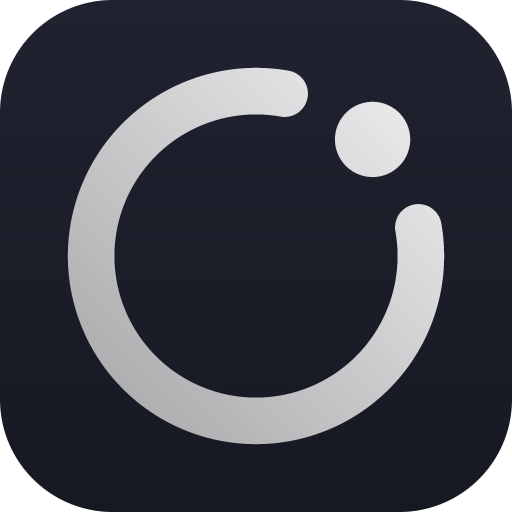

# Halo

A quiet AI copilot that floats over your screen and is invisible to screen recording and screen sharing. Local-first, one dependency on the outside world: your Anthropic API key.

<p align="center"></p>

## What it does

- **Capture** (`⌘⇧C`) — screenshots the display under your cursor and asks Claude what you most likely need (solve the problem on screen, answer the question, explain the error, draft the reply). Type a question in the bar to steer it; follow-ups keep the conversation.
- **Listen** (`⌘⇧L`) — interview mode. Transcribes the conversation with a Whisper model that runs entirely on your machine, then suggests what to say next as the interviewer talks. "Answer now" forces a suggestion; auto-suggest can be turned off.
- **Invisible to capture** — the window is flagged `NSWindowSharingNone` (Electron `setContentProtection`), so Zoom, Meet, Teams, QuickTime and screen recordings all see straight through it. It also excludes itself from its own screenshots.
- **Two presets** — **Talk** for video or in-person conversation: top of the screen, transcript, spoken-style answers, auto-suggest. **Code** for live coding: docked to a corner so it covers less of the editor, narrower, code-first answers, auto-suggest off because you trigger Capture on the problem. Each remembers where you last dragged it.
- **Doesn't steal focus** — buttons and hotkeys never take keyboard focus from your call or editor, so a browser never sees you "leave the page". Only the question box takes focus, and hands it back on Enter or Esc. Halo never injects keystrokes or moves the pointer.
- **Always readable** — in Auto appearance Halo samples the screen behind the pill every 2 seconds. Over bright content it uses dark glass with white text, and over dark content it uses light glass with dark text. A hairline outline keeps it visible on busy, mid-tone backgrounds.
- **Floats everywhere** — always on top, on every Space, over full-screen apps, hidden from Mission Control, no Dock icon. Lives in the menu bar.

## Run it

```bash
npm install
npm start
```

First launch:

1. Settings → **Account**: paste your Anthropic API key (console.anthropic.com → API keys). It is encrypted with the macOS keychain and stored in `~/Library/Application Support/Halo/halo.json`. `ANTHROPIC_API_KEY` in your environment also works.
2. macOS will ask for **Screen Recording** the first time you press Capture, and **Microphone** the first time you press Listen. Grant both, then relaunch if prompted. In dev the permission is granted to "Electron"; run `npm run dist` to get a real `Halo.app` under `release/` that owns its own permissions.
3. Settings → **Profile**: upload your resume (PDF, DOCX, TXT or Markdown, parsed locally), paste or upload the job description, and add notes. Interview suggestions draw on all three.
4. The first Listen downloads the speech model once (about 150 MB for Whisper base) and caches it locally.

## Shortcuts

All four are `⌘⇧` plus a letter you can remember, and all four can be changed in Settings → Shortcuts.

| Keys | Action |
|---|---|
| `⌘⇧H` | **H**alo: show / hide the overlay |
| `⌘⇧C` | **C**apture screen and ask |
| `⌘⇧L` | **L**isten: start / stop interview mode |
| `⌘⇧M` | **M**inimize: collapse the answer panel down to the bar, or expand it again. Listening keeps running while collapsed and a dot marks a new suggestion. |
| `⌘⇧D` | **D**ock: move the overlay to the next screen corner |
| `Esc` | Hide |

Drag the bar to move it; the position is remembered per preset. A typed question always comes with a fresh screenshot; Settings → General can turn that off for follow-ups to save tokens.

## Settings

- **General**: appearance (Auto, always dark, always light), focus policy, model (Claude Opus 5.5 by default; Sonnet 5.5 and Haiku 4.5 are faster, Fable 5.1 is the most capable), answer depth for screen questions, auto-suggest, screenshot attachment. Interview suggestions always run at low effort for speed.
- **Profile**: resume upload, job description, notes. Everything is parsed and stored on your Mac and sent to Claude as background for suggested answers, so they draw on your real experience.
- **Audio**: your microphone, an optional second input for the call audio, background-noise suppression, a live level meter, and the speech model. With both inputs set, the transcript is labelled **You** and **Interviewer**, suggestions key off the interviewer's side only, and Claude sees who said what (Whisper tiny / base / small, WebGPU when available, WASM otherwise). To hear the interviewer, use speakers, or install a loopback device such as [BlackHole](https://existential.audio/blackhole/) and select it (or a multi-output device mixing it with your mic). Direct system-audio capture is only available on Windows.
- **Shortcuts**: click a field, press the keys. Combinations another app already owns are flagged.
- **Account**: API key and quit.

## How it is built

- Electron main process (`src/main/`): window flags, global shortcuts, tray, screen capture, settings, and all Claude calls (`@anthropic-ai/sdk`, streaming, server-side refusal fallbacks enabled). The API key never enters the renderer.
- Renderer (`src/renderer/`): the glass UI in plain HTML/CSS/JS with the Geist variable font, bundled by esbuild into `dist/`. Served from a privileged `app://` scheme so the Whisper weights can be cached and WebGPU/threads work.
- `src/renderer/worker.js`: transformers.js Whisper pipeline in a Web Worker. Audio is gated by a simple energy-based voice-activity detector and sent in utterance-sized chunks.
- `src/main/documents.js`: local text extraction for resumes and job descriptions (`pdf-parse`, `mammoth`).
- `scripts/make-icons.mjs`: renders the logo to PNG for the menu bar and app icon, no image library needed.

Useful scripts: `npm run dev` (overlay visible to screen capture, for screenshots), `npm run smoke` (headless load check), `npm run dist` (build `Halo.app`).

## Notes

- Content protection is honoured by every capture API on macOS and Windows. Hardware capture cards and phone cameras still see your monitor.
- Use responsibly and within the rules of whatever you are in.
